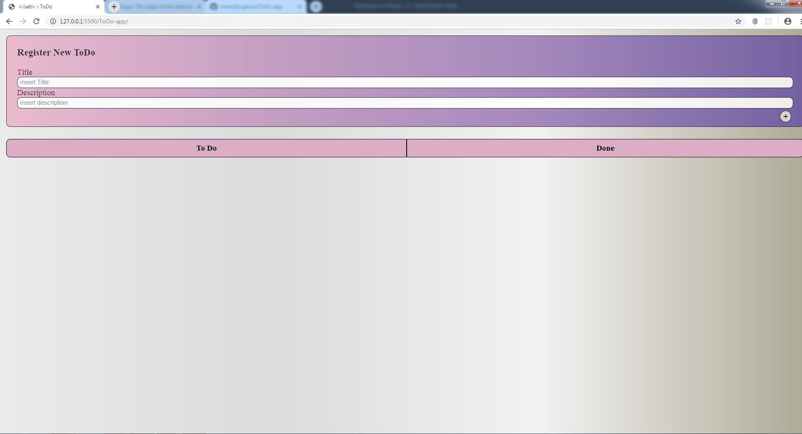
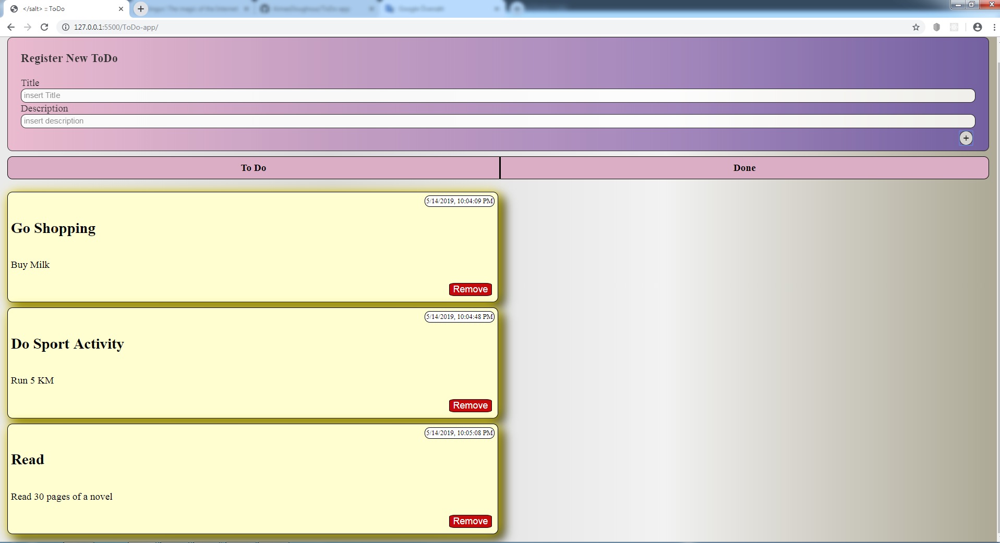
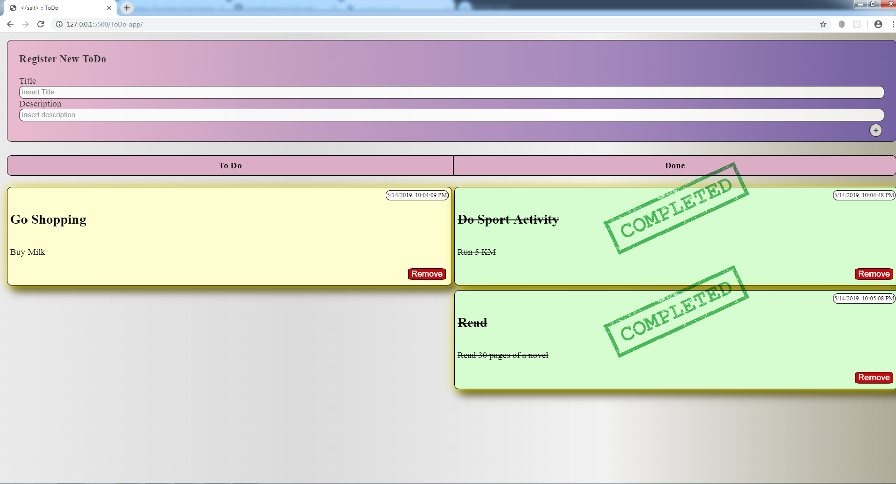

# &lt;/salt&gt;

## Salt ToDo

This is a simple todo app- no backend

- You can add a task. when you add one you will have a time stamp.
- Clicking a card will mark as "Completed" and will move the card under the "Done" section, clicking it again will remove the mark and return the card to the "ToDo" section.
- Clicking the remove button will remove the card.

Screenshots:

